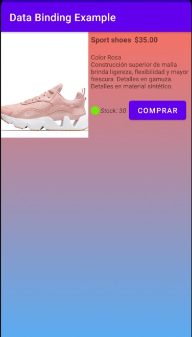
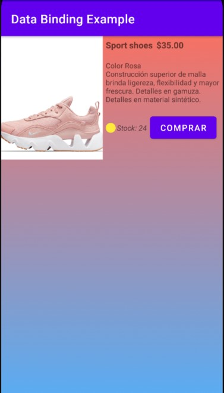
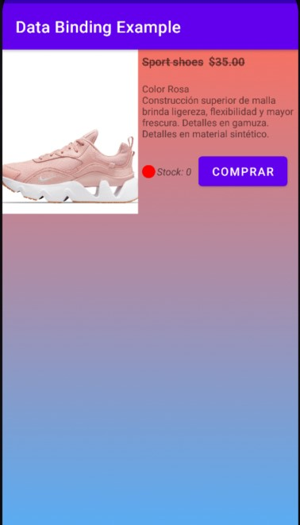

# DataBindingExample

A Simple App Example using DataBinding: Binding Adapters, LiveData-MutableLiveData.

The app shows a card with informatión of a product like title, price, description, stock and a buy button. When we click the button, stock decrease, when is > 25 the app considers a high stock and draws one green icon:

    

When stock is > 10 that icon is yellow:

    

If stock is < 10 the icon is red, finally if stock = 0 the title and the price are crossed out by a line:

    

This concept may be implemented in an app with petitions to an API REST and RecyclerViews
